# micro:bit make a map

# Leader notes

## Outcomes
Young people develop a range of practical and contemporary skills which are useful in their school, work and social life.

## Overview

This activity fulfills Stage 2, Requirement 2 of the Digital Maker Staged Activity Badge (Create a simple computer program to help with a scouting activity, and try it out) and Stage 2, Requirement 4 of the Navigator Staged Activity Badge.

Young people will use Scratch along with a micro:bit to draw a map of a wilderness area they have visited or are planning to visit.

A completed project can be found online at [rpf.io/scouts-microbit-map-on-complete](rpf.io/scouts-microbit-map-on-complete)
## Information 

+ Time - 45 minutes
+ Group size - Flexible (ideally two young people per computer and micro:bit)
+ Preparation needed - If you’re running this activity without access to WiFi, you will need to download the software and starter project ahead of time. You may also wish to print handouts.
+ Location - Wherever you have computer access

## You will need

+ Laptops or desktop computers
+ micro:bits and USB cables
+ Scratch either online or offline
+ Scratch Link Software installed
+ Per group:
  + One laptop or desktop computer
  + One micro:bit
  + One USB A to micro USB B cable
+ Activity handouts

### If your meeting place has Internet Access

Run Scratch online in a web browser with an internet connection using this link rpf.io/scratchon.

Download the Scratch Link software and install the Scratch micro:bit HEX code on the micro:bits beforehand. Refer to the instructions at rpf.io/scratch-link

### If your meeting place doesn’t have WiFi

Download the Scratch Desktop application beforehand; refer to the Scratch guide rpf.io/scouts-scratch for instructions. 

Download the Scratch Link software and install the Scratch micro:bit HEX code on the micro:bits beforehand. Refer to the instructions at rpf.io/scratch-link

## Key messages

+ External inputs, such as buttons as sensors can be used with a computer.
+ Infinite loops can be used to detect events and then conditional selection can be used to alter the behavior of a program depending on the event detected.
+ Scratch can be used as a digital canvas on which images can be drawn.

## Leader instructions
1. Discuss digital arts programs the young people may have used such as Microsoft Paint, and how you might use a mouse or a tablet to draw on a digital canvas.
2. Explain that you can use a variety of input devices to interact with a computer, and that they are going to make a program that will allow them to draw their own maps.
3. If they have not used them before, introduce the young people to the micro:bit. Explain that micro:bits not only have two buttons (for input) but they are also able to sense which way they are tilted.
4. Demonstrate how to start the Scratch Link software


4. Demonstrate how to connect the micro:bit to the computer and open Scratch (online or offline), and then the starter project.
5. Demonstrate how to use the Scratch Link software to connect the micro:bit

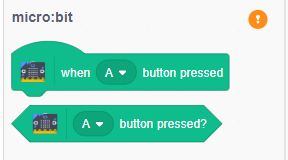

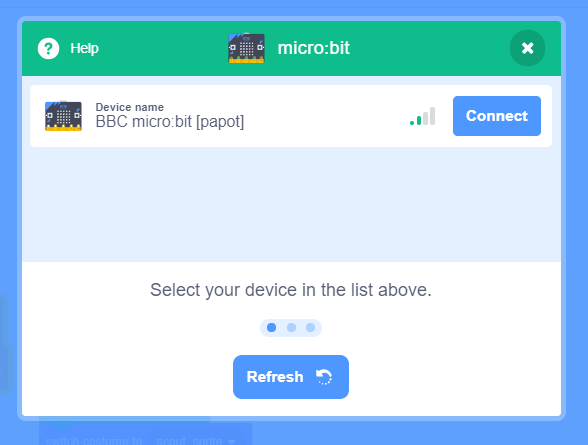

5. With the instructions in the printout, the young people will create code in Scratch allowing them to use their micro:bits to draw a map.
6. Once the project is complete, young people can use their program to create their own custom maps in Scratch, of an campsite environment they have visited.

## Alternatives

+ If micro:bits are not available, this resource can be completes using key presses and the mouse instead.

## Safety

If the young people are working online, tell them to ask for permission before viewing any other websites. It’s a good idea to set up parental controls — you can find instructions for this on the NSPCC website (rpf.io/scouts-nspcc-online).

You should also give each young person a Stay Safe leaflet (rpf.io/scouts-staysafe).

## Adaptability

Here other badge resources primarily cover how you’d adapt this for different educational needs

## Reflection

You can talk about how digital cartography has changed all our lives over the last few years:
- Online maps with photographic overlays allows viewing an area with a high level of detail
- Route finding algorithms mean that computers can plan fast and efficient routes between two points
- Digital maps in combination with GPS technology, allows people to know their exact location along a route at any given time.

# Activity / project title

# Handout

You are going to make a computer program using Scratch that will let you use a micro:bit to control your sprite, and then create a digital map of an area you have visited or will be visiting. Tilting the micro:bit controls where the sprite will move, while the buttons can be used for drawing paths and placing down map icons.

## Did you know

+ Digital maps have led to some very interesting discoveries, such as when an archaeologist called Angela Micol used Google maps to discover some previously unknown pyramids in Egypt.

## Instructions

### Part 1: Setting up
1. Open the starter project at [rpf.io/scouts-microbit-map-on](rpf.io/scouts-microbit-map-on) or if you are offline open the starter project that your leader has provided you.

2. Connect micro:bit step here - will have to see what happens with starter project.

3. Start by clicking the green flag. The `scouts` sprite should read out the instructions for the map maker program and then shrink down in size.

### Part 2: Moving the scout
You are going to write some code that will control the direction the scout sprite moves, depending on the direction the micro:bit is tilted.

1. Add a `green flag clicked` block to the program from the **Events** menu.


2. The program needs to be able to detect any movement of the micro:bit. To do this, it needs always be listening for events. Add a `forever` loop beneath the `green flag clicked` block. You can find it in the **Control** menu.


3. Inside the forever loop, add an `if then` block from the **Control** menu.

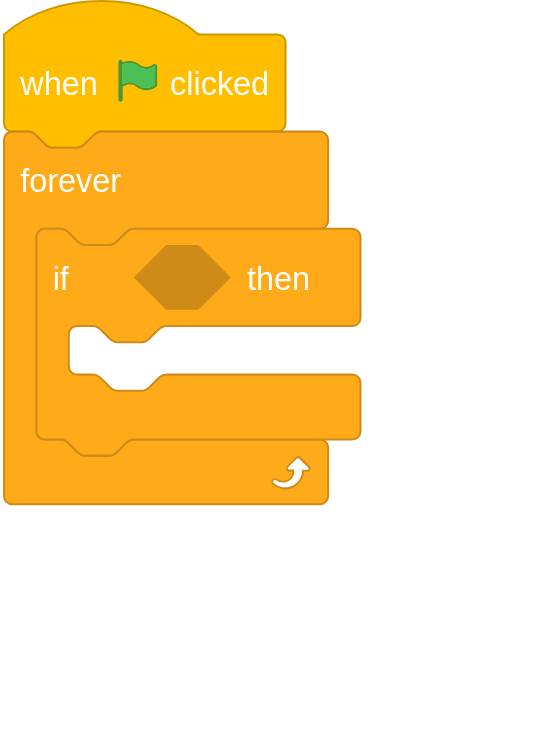

4. Now you can add in a block to detect a tilt of the micro:bit. From the **micro:bit** menu, find the `tilted any ?` block and place it into the `if then` block.

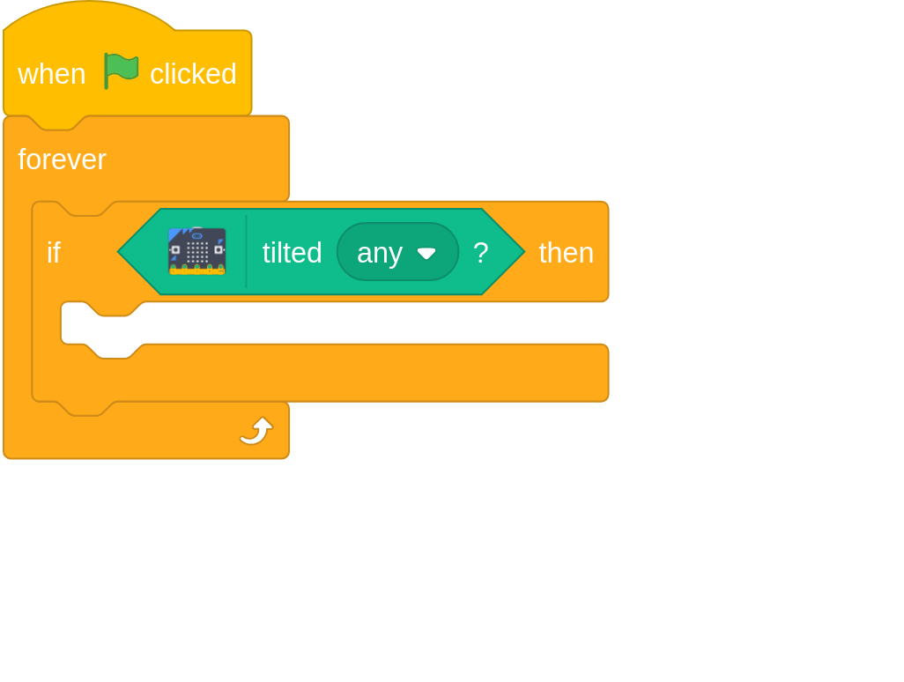

5. Use the drop down menu within the `tilted any ?` block to change it to `tilted right ?`, and then within the `if then` block you can tell your program to change the x position of the sprite. You can find the blocks to change position in the **Motion** menu.

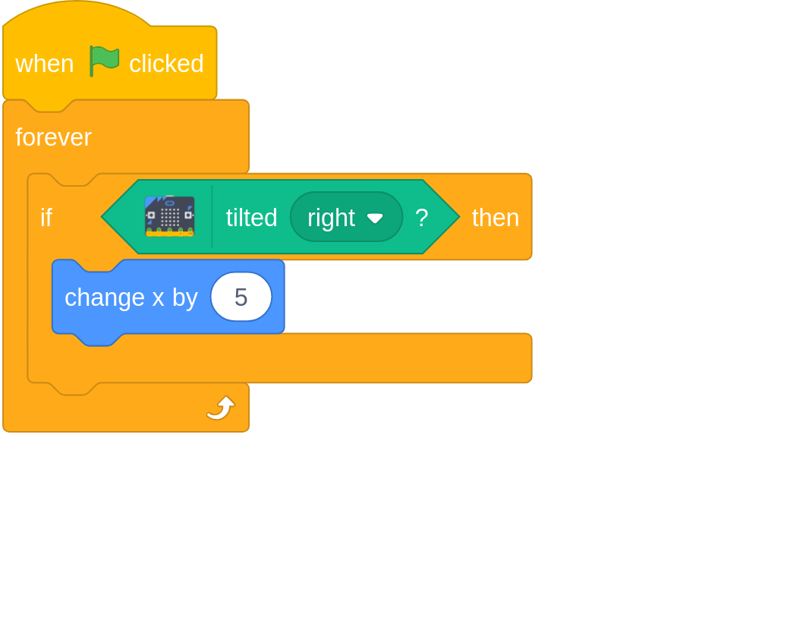

6. Click the green flag to run your program and after the sprite reads the instructions, try tilting your micro:bit to the right. Your sprite should move across the screen.

7. Now that the sprite can be controlled in one direction, it is time to add in the other directions of movement. Add in more `if then`, `tilt any ?` along with blocks to change direction, until your program looks like this.

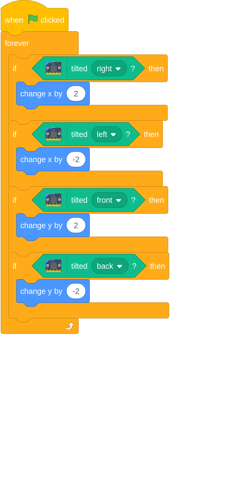

8. Run your program again and test that you can use the micro:bit to move your sprite around the screen. You will notice that if you tilt the micro:bit in two directions, it will move diagonally.

9. Later on you will add some code to change the scout's costume. When the micro:bit is tilted, however, you need the costume to change back to the scout costume. Use a `tilt any ?` block within an `if then` block to make sure that when the micro:bit is tilted the costume is always a scout. You can find the `switch costume to` block in the **Looks** menu.

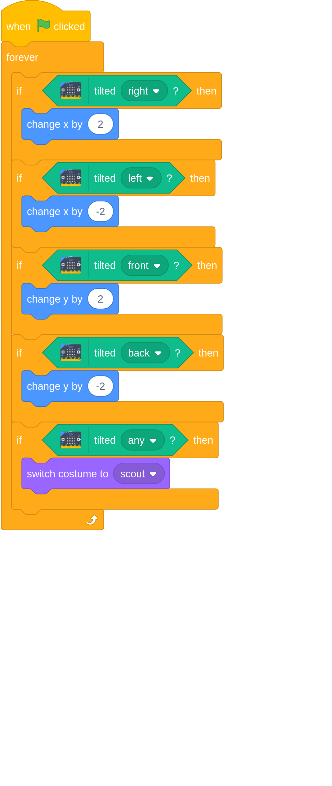

10. To finish off this part, when the micro:bit is tilted and you hold down button A, the scout should draw a line on the screen, to represent a path or a trail. Add in a `if then else` block to your program that detects if the button is pressed, and then places the `pen down`, or lifts the `pen up` if it is not pressed. You can find the blocks to control the pen in the **Pen** menu.

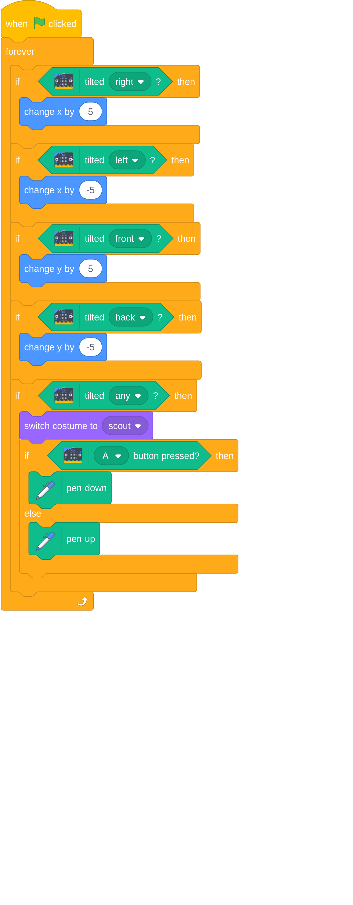

11. Test your program again. When you are moving the sprite around and press button A, it should draw a brown line. When you release the button then it should stop drawing. If the micro:bit is not tilted, then no lines should be drawn.

12. Spend a little time practicing drawing lines on the screen, using your micro:bit.

**THE BELOW CODE IS FOR SCRATCHBLOCKS.GITHUB.IO AND NOT PART OF THE RESOURCE**
```
when flag clicked
forever
if <tilted (right v) ? ::extension microbit> then
change x by (5)
end
if <tilted (left v) ? ::extension microbit> then
change x by (-5)
end
if <tilted (front v) ? ::extension microbit> then
change y by (5)
end
if <tilted (back v) ? ::extension microbit> then
change y by (-5)
end
if <tilted (any v) ? ::extension microbit> then
switch costume to (scout v)
if <(A v) button pressed? ::extension microbit> then
pen down
else
pen up
end
```

### Part 3: Adding map icons

Now that you can move the scout around the screen and draw trails, it is time to add icons to the map.

1. You will need a new set of blocks for this part of the program, to listen for button pushes when the micro:bit is not tilted. Start by adding a `green flag clicked` block along with a `forever` block and an `if then` block.


2. To detect that the micro:bit is not being tilted you can use a `not` block. You can find this in the **Operators** menu

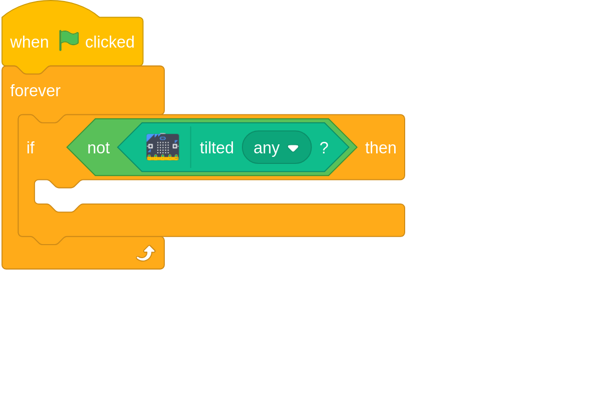

3. When you press button A now, the sprite should cycle through it's costumes, and then `wait` for a little bit. The current icons you have are a tree, a hill and a campsite. There is also a white square that you can use to erase stamps. You can add more costumes later if you like.

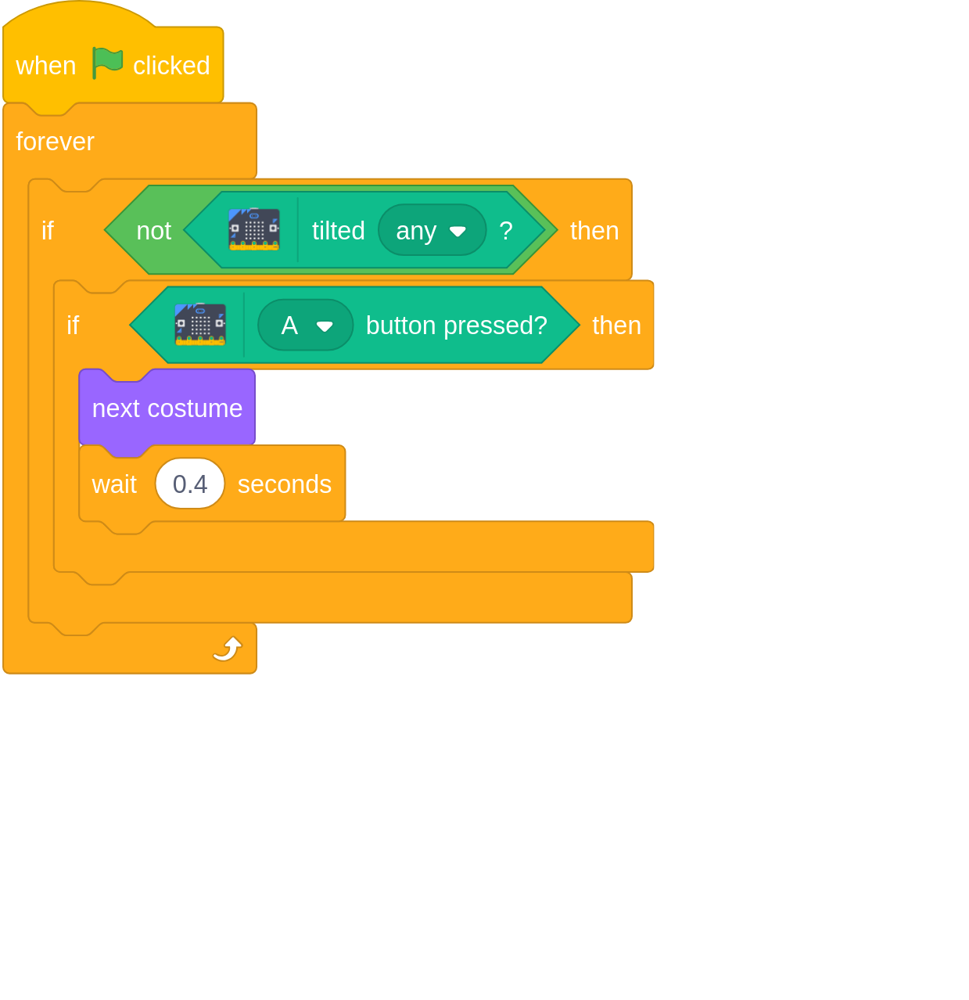

4. Test that your code works by moving the micro:bit around, and then holding it flat and pressing button A. When you tilt the micro:bit again the costume should change back to the scout sprite.

5. Next, the costume that is displayed should be stamped on the stage. You can find the `stamp` block in the **Pen** menu.

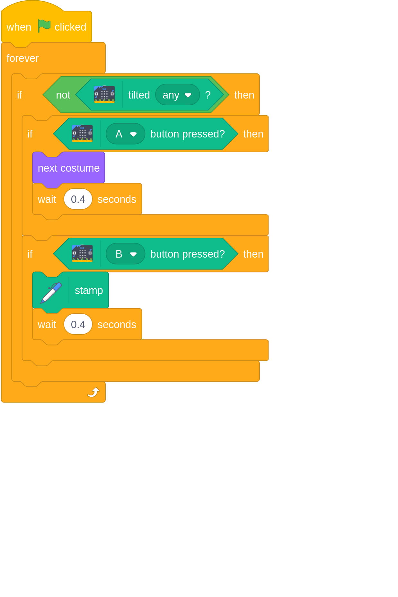

6. Now your program is complete. You should be able to move your sprite around by tilting the micro:bit, and then while holding it level you can change costumes to any of the map icons using button A and place the icons on the stage using button B. Have a go at creating your own map of a place you have visited, or even design your own map of your perfect campsite.

7. When you have finished drawing your map, you can right click on the stage and `Save image as...` so that you can keep your map and even print it off.

**THE BELOW CODE IS FOR SCRATCHBLOCKS.GITHUB.IO AND NOT PART OF THE RESOURCE**
```
when flag clicked
forever
if <not<tilted (any v) ? ::extension microbit>> then
if <(A v) button pressed? ::extension microbit> then
next costume
wait (0.4) seconds
end
if <(B v) button pressed? ::extension microbit> then
pen down
stamp
pen up
wait (0.4) seconds
```

## Tip

It might help for the young people to hand draw their maps first, or to attempt to copy a map that has been provided for them.

## Sharing

Young people can share their projects by clicking on the `Share` button in Scratch.


[greenflag flag clicked]:assets/greenflag.png
[forever]:assets/forever.png
[if then]:assets/if_then.png
[tilted any ?]:assets/tilted_any.png
[tilted right ?]:assets/tilted_right.png
[switch costume to]:assets/switch_costume.png
[pen up]:assets/pen_up.png
[pen down]:assets/pen_down.png
[not]:assets/not.png
[wait]:assets/wait.png
[stamp]:assets/stamp.png
